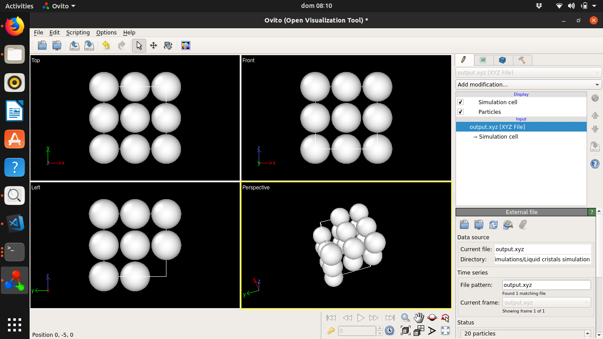
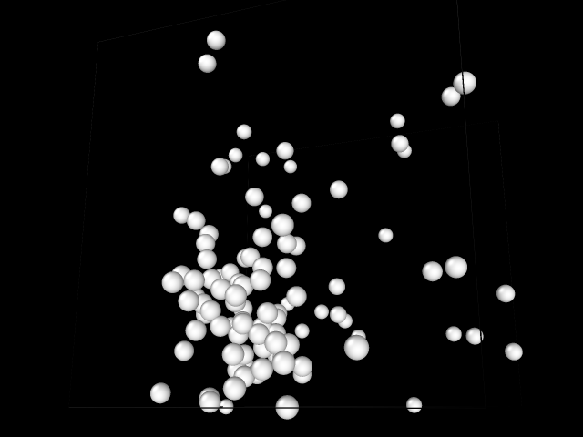

Attempts to creat a version in CUDA!!!
========================

## Compilation

`nvcc test_ParticleSystem.cu -o test_ParticleSystem`

You can try it on: https://colab.research.google.com/drive/1zZuwdMKnG41vZfTANDp-W5sSaR4BQbLV

## Screenshots

Wait a minute, it isn't ready yet, so no screenshots, but just for inspiration, 
here are the ones from the pure C++ version :)

.png)
.png)
