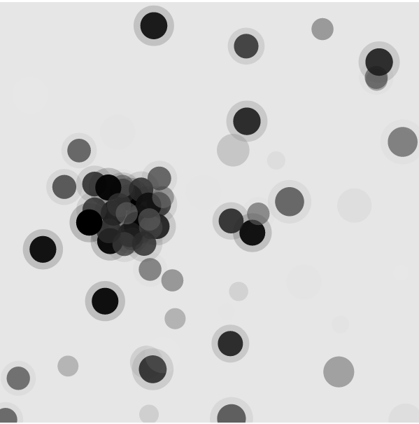
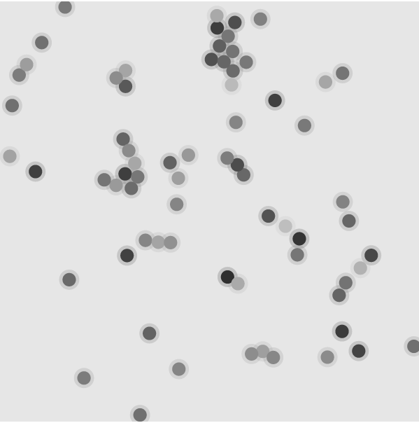
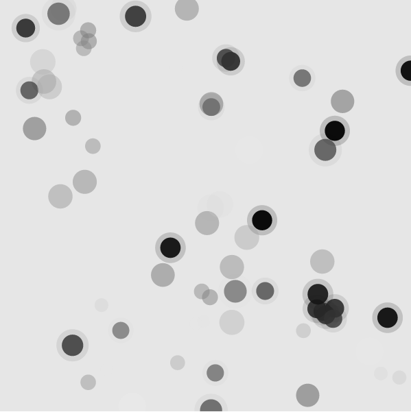

Liquid cristals simulation
==========================

This molecular dynamics simulation is based on the code and the description in: http://www.pages.drexel.edu/~cfa22/msim/node27.html

Usage
-----

**TLDR**: *Setup: `$ make main; websocketd --port=5678 main.out`. Visualization: 
open `visualization/index.html` in your browser.*

To compile type: `$ make main`

The visualization is done using [p5.js](http://hello.p5js.org/), but don't
worry, the library is already included here so you don't have to install it or 
to have a working internet connection to visualize it. 

The visualization requires to have [websocketd](http://websocketd.com/) 
installed.  When you have it, and the code is compiled, setup the simulation 
server with the following command: 
`$ websocket --port=5678 main.out [arguments]` 
where `[arguments]` are the optional arguments to the `main.out` executable and 
visualize it by opening in a browser the file: `visualization/index.html`

The visualization is in 2D, but an attempt is made to give the illusion of 
depth. By default, the simulation is in 3D, but can also be in 2D by tweaking 
the `DIMENSIONS` variable in the Makefile (first line).

NOTE: Make sure that you call `make clean` before recompiling for a change from 
2D to 3D or viceversa.

