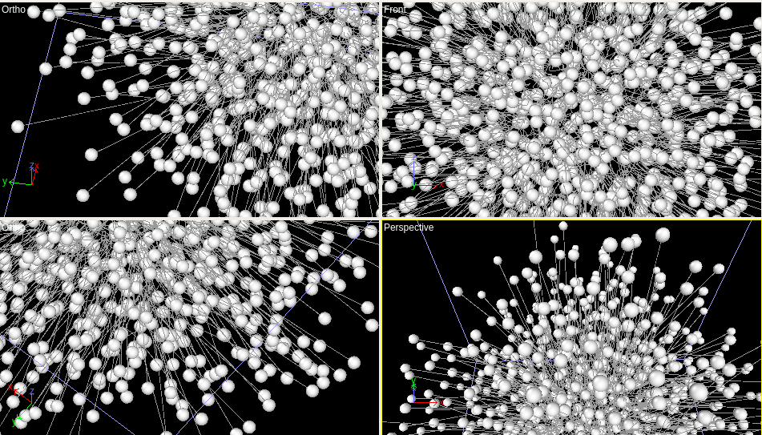
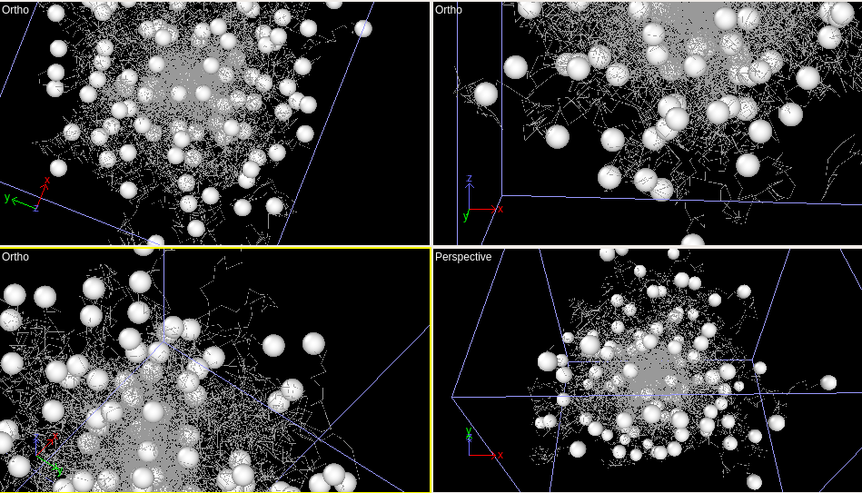
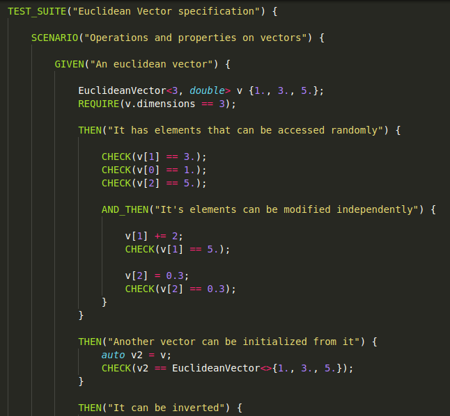
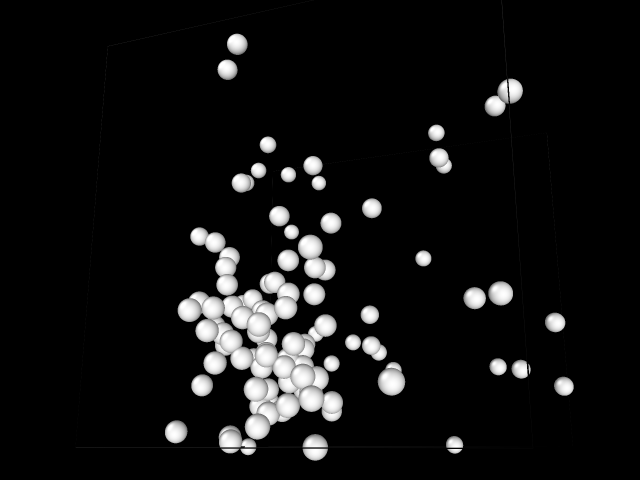

Molecular Dynamics simulation in CUDA!!!
===============================

## Compilation

`make compile && ./pcuditas_main.out` or simply `make run`.

## Examples

You can check other examples of simulations in the `examples/` folder.
For example, here is a screenshot of a random walk in GPU:

Also, each file has it's own tests. Those are written in such a way
that they show how to use the code. If you want to become familiar 
with the internals of the program, that's the best way.

For example, here is a sample of the tests for the `EuclideanVector` class, from
the file `pcuditas/vectors/EuclideanVector.cu`.

## Screenshots

.png)
.png)
